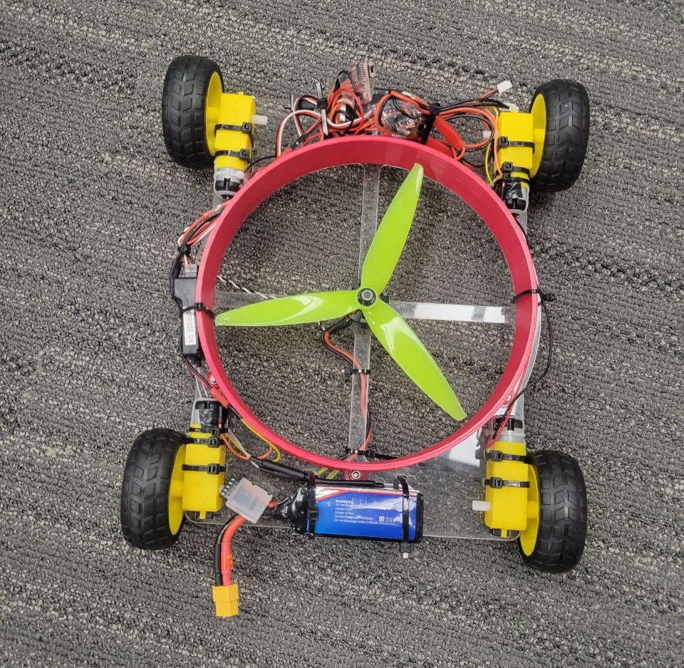
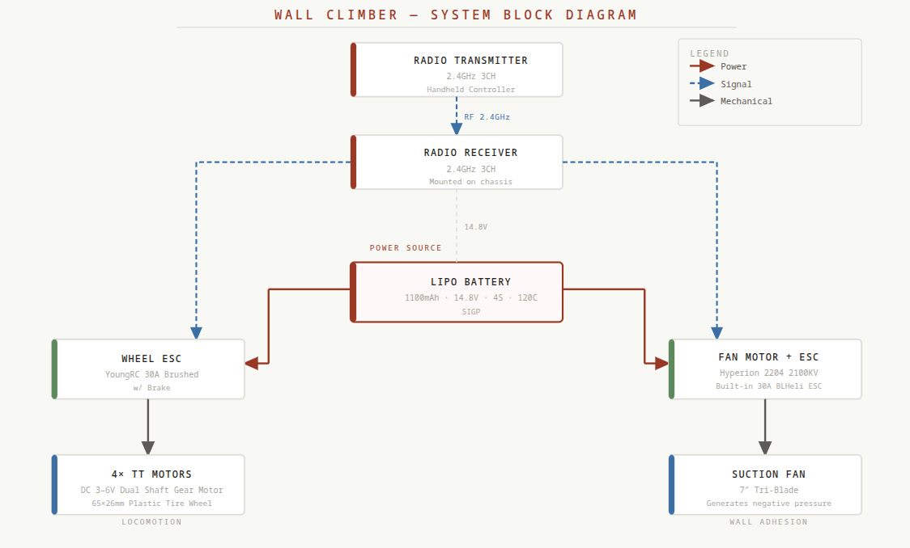
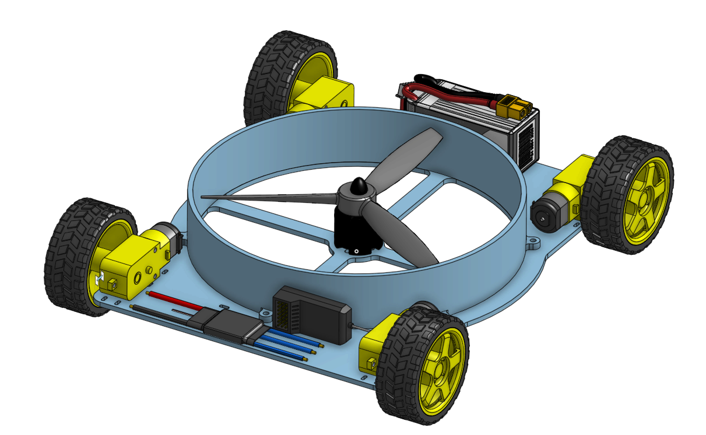

# Wall Climber Robot

A remote-controlled robot designed to scale vertical surfaces using a suction-based adhesion system. A 7-inch tri-blade fan driven by a brushless motor generates negative pressure beneath the chassis, pulling the robot firmly against the wall while four TT gear motors drive it in any direction across the surface.

The project spans mechanical design, power systems, and RC integration — from a laser-cut acrylic frame and 3D-printed PLA shroud that channels suction, to a 4S LiPo power system capable of driving both the locomotion and adhesion systems simultaneously.

The system is divided into four primary sections:

- [Bill of Materials](#bill-of-materials)
- [Mechanical](#mechanical)
- [Electrical](#electrical)
- [Design Challenges](#design-challenges)

Image of robot:  

---

## Bill of Materials

| Component | Part |
|-----------|------|
| Drive Motors | 4× DC 3–6V TT Dual Shaft Gear Motor |
| Wheels | 4× 65×26mm Plastic Tire Wheel |
| Wheel ESC | YoungRC 30A Brushed ESC w/ Brake |
| Fan | 7″ Tri-Blade Fan |
| Fan Motor | Hyperion 2204 2100KV CW Motor w/ Built-In 30A BLHeli ESC |
| Battery | SIGP 1100mAh 14.8V 120C 4S LiPo |
| Radio System | 2.4GHz 3CH RC Transmitter & Receiver |
| Frame Material | Laser-Cut Acrylic |
| Shroud Material | 3D Printed PLA |

---

## Mechanical

The frame is laser-cut from acrylic sheet, chosen for its rigidity, low weight, and ease of fabrication. The shroud — the sealed enclosure that channels airflow from the fan to create suction against the wall — is 3D printed in PLA. Together they form a compact platform that keeps the center of mass as close to the wall surface as possible to minimize the tipping moment during climbing.

- Acrylic frame provides a rigid, flat mounting surface for all electronics and motors.
- PLA shroud is designed to seal around the fan and form a low-pressure chamber against the climbing surface.
- Four TT dual-shaft gear motors are mounted at the corners for 4WD drive.
- Wheels are 65×26mm plastic tire wheels matched to the TT motor shaft spec.

CAD files for both the shroud and the acrylic frame are included in this repository.

### System Architecture

The LiPo battery is the single power source for both ESCs. The 2.4GHz receiver independently routes control signals to the wheel ESC (locomotion) and the fan motor ESC (adhesion), giving the operator independent control over drive and suction.

#### Block diagram:  

#### CAD Assembly

*The Onshape assembly file shows the rough placement of parts. Components are not fully constrained or mated, so this is meant as a visual reference only. Assembly file is provided.*

---

## Electrical

The robot is powered by a single 4S LiPo battery delivering 14.8V with a 120C discharge rating — providing ample current headroom for both the brushless fan motor and the four brushed drive motors running simultaneously. Two separate ESCs manage the two subsystems independently, both receiving control signals from the 2.4GHz receiver.

- The fan motor ESC is built directly into the Hyperion 2204 motor unit, simplifying wiring and saving space.
- The YoungRC brushed ESC handles all four TT drive motors and includes a brake function.
- The 2.4GHz 3-channel receiver routes throttle and steering signals to each ESC on separate channels.
- The 120C LiPo discharge rating ensures voltage sag is minimal even under peak simultaneous load from both systems.

**Important:** The fan must be spun up to operating speed before the robot attempts to drive. Attempting to move before full suction is established will cause the robot to lose grip.

---

## Design Challenges

Vertical locomotion introduces a set of constraints that don't exist for ground robots. Every gram of weight works directly against the adhesion force, so the design required careful balance between suction output and total mass — particularly with a 4S LiPo and brushless motor system adding significant weight.

- Shroud geometry needed to minimize air leakage around the perimeter while still allowing the wheels to contact the surface.
- The 18mm ground clearance (wheel height above the wall surface) set a firm constraint on the suction chamber depth and fan sizing.
- At 668g total weight, the fan and shroud system must generate enough negative pressure to hold the robot against the wall under dynamic loads from the drive motors.
- The acrylic frame had to be stiff enough to prevent the chassis from flexing away from the wall surface under suction load.